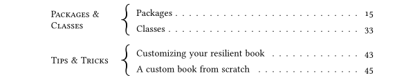

# fancytoc.sile

[](LICENSE)
[](https://github.com/Omikhleia/fancytoc.sile/actions?workflow=Luacheck)

> [!IMPORTANT]
> This module is now provided as an integral part of the [resilient.sile](https://github.com/Omikhleia/resilient.sile) collection (release v3).
> The new implementation is distributed under different license terms.
>
> This repository is no longer maintained and will be archived. 

This package for the [SILE](https://github.com/sile-typesetter/sile) typesetting
system provides an alternative way to output a table of contents, with two levels
only being used, but with nice curly braces!



The idea for such a table of contents came from a question from Caleb Maclennan
in the SILE github repository, from a book he had seen, and I liked it so much
that I used it in [one of my books](https://sites.google.com/site/dragonbrumeux/contes-et-l%C3%A9gendes-dalmaq)
made with SILE. So here it is, now provided as an standalone package.

If the [resilient](https://luarocks.org/modules/Omikhleia/resilient.sile) collection
is installed too, then the fancy table of contents may be styled with the nice styling
specifications offered there. Otherwise, a default styling is applied (which can be
overidden by redefining some internal commands or hooks, I kept that possibility,
but, hey, you might rather want to give a try to the “resilient” classes and packages
collection.)

## Installation

This package requires SILE v0.14 or upper.

Installation relies on the **luarocks** package manager.

To install the latest version, you may use the provided “rockspec”:

```
luarocks install fancytoc.sile
```

(Refer to the SILE manual for more detailed 3rd-party package installation information.)

## Usage

The in-code package documentation may be useful.
A readable version of the documentation is included in the User Manual for
the [resilient.sile](https://github.com/Omikhleia/resilient.sile) collection
of classes and packages.

## License

All SILE-related code and samples in this repository are released under the MIT License, (c) 2022 Omikhleia.
